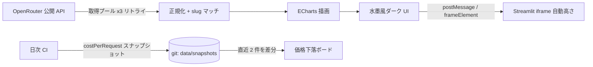

<p align="center">
  
</p>

<h1 align="center">AI Model Rankings</h1>

<p align="center"><b>水墨風ダッシュボードで見る AI モデル実時戦力ランキング — 使用量・ベンチマーク・コスパ・速度・トレンドをひと目で。</b></p>

<p align="center">
  
  
  
  
</p>

<p align="center"><b><a href="https://ai-model-rankings.streamlit.app/">🌐 ライブデモ (ai-model-rankings.streamlit.app)</a></b></p>

<p align="center"><a href="./README.md">English</a> | <a href="./README.zh-CN.md">简体中文</a> | <b>日本語</b></p>

<p align="center"><i>榜如水墨，浓淡随时 — ランキングは墨のごとく、5 分ごとに濃淡を変える。</i></p>

📖 目次
---

- [✨ 特徴](#-特徴)
- [🧠 仕組み](#-仕組み)
- [📖 使い方](#-使い方)
- [📁 プロジェクト構成](#-プロジェクト構成)
- [🚀 クイックスタート](#-クイックスタート)
- [🌐 デプロイ](#-デプロイ)
- [🛠️ カスタマイズ](#️-カスタマイズ)
- [❓ FAQ](#-faq)
- [📄 ライセンス](#-ライセンス)

✨ 特徴
---

- **🏆 使用量 Top 12** — 直近 24 時間の 400 以上の稼働モデルについて、実際のトークン消費量とリクエスト数を集計。無料バリアントをハイライト。
- **👑 カテゴリ別王者** — 各分野の現時点の No.1：総合知能 / コーディング / エージェント（Artificial Analysis）、Web 開発・データビズ・ゲーム開発・UI（Design Arena ELO）、コスパ、週間急上昇。
- **📐 ディメンション別チャンピオン** — 各ディメンションで最強の 1 モデルを一覧できるテーブル。
- **💰 コスパ スキャッター** — 1 リクエストあたりコスト vs 知能指数、バブルサイズ = 使用量。
- **⚡ 速度スキャッター** — P50 レイテンシ vs スループット、バブル = リクエスト数。
- **📈 30 日トレンド** — トップ 6 モデルの日次トークン推移ライン。
- **🏢 ベンダーシェア & タスク支出** — 週間マーケットシェアのドーナツ、30 日カテゴリ別支出のドーナツ。
- **🗂️ カテゴリボード** — プログラミング / 自然言語 / 長文コンテキスト / 画像 / ツール呼び出し / 動画の各ボード。
- **🐎 ダークホース & 新モデル** — 週間伸び率トップにスパークライン付き。直近 14 日で追加されたモデルも表示。
- **🧰 ツールボックス** — モデル対決（`?vs=slugA,slugB`）、無料バリアント榜、中国勢 vs 海外勢、**日次価格下落ボード**（git をデータベースにしたスナップショット）、月額コスト計算機。
- **🔍 モデルカード** — どのボードのモデルでもクリックすれば全ディメンションのポップアップ。そのまま比較ツールへも飛べる。
- **🖨 拓印（インクスタンプ）** — ワンクリックでサイトの水墨スタイルのシェアカード（Top-5 ボードまたは単一モデル）を canvas 描画。
- **🎨 水墨風ダーク UI** — 馬山鄭（Ma Shan Zheng）の書体、印章、重なり合う山々。ベンダーは**実際のブランドカラー**で描画（Claude オレンジ、GLM ブルー、OpenAI グリーン…）。
- **🔄 自動リフレッシュ** — 5 分ごと。時刻表示は北京时间（北京時間）。

🧠 仕組み
---



1. ブラウザが OpenRouter の 12 個の公開エンドポイントへ並列取得（3 系列プール、空レスポンス & ネットワークリトライ付き）。
2. レスポンスを正規化（`{data:{data:[…]}}` の剥がし）。日付付きモデル slug はベース slug に潰して、ベンチマーク・コスト・名称を結合。
3. ECharts が 7 チャート + 2 カードグリッド + 1 テーブルを描画。ベンダーのブランドカラーは全チャートで一貫適用。
4. 日次 CI ジョブが `costPerRequest` スナップショットを `data/snapshots/` にコミット——価格下落ボードは直近 2 件を差分引きし、バックエンドなしの静的サイトに履歴を与える。
5. `app.py` がページを全幅の Streamlit コンポーネントとして埋め込み、ページ自身が iframe を実コンテンツ高さまで伸ばす。

📖 使い方
---

- **Tokens / Requests** — 使用量ランキングの指標を切り替え。
- **カテゴリタブ** — カテゴリボードを切り替え（プログラミング / 自然言語 / 長文コンテキスト / 画像 / ツール呼び出し / 動画）。
- **ツールボックス（拾贰、初期状態は折りたたみ）** — `?vs=` 付き URL で共有できるモデル対決、無料モデル榜、中国勢 vs 海外勢、価格下落、コスト計算機。
- **モデルをクリック** — 全ディメンションのポップアップ。「加入对比（比較へ追加）」で比較ツールに送り、「拓印」で水墨風 PNG を描画。
- **どこでもホバー** — 全チャートに完全なツールチップ（slug、ベンダー、シェア、コスト、プロバイダ）。
- **⟳ 刷新** — 強制再取得。データは 5 分ごとに自動リフレッシュもされる。

📁 プロジェクト構成
---

```
ai-model-rankings/
├── app.py                  # Streamlit エントリ：ページを全幅で埋め込み
├── build.py                # index.html → Streamlit インライン書き換え（CI でテスト）
├── requirements.txt        # streamlit のみ
├── .streamlit/config.toml  # Streamlit クローム向けのダークシルクテーマ
├── index.html              # ページ本体
├── css/style.css           # 水墨風ダークテーマ
├── js/app.js               # データ層 + チャート + カード（window.MB を公開）
├── js/tools.js             # ツールボックス：比較 / 無料 / 対決 / 価格下落 / 計算機
├── js/card.js              # モデルポップアップ + 拓印シェアカード
├── scripts/snapshot.py     # 日次 costPerRequest スナップショット（CI スケジュール）
├── data/snapshots/         # git をデータベースに：価格ボードの日次コスト履歴
├── vendor/echarts.min.js   # 同梱 ECharts 5.6.0（CDN 不要、完全オフライン）
├── logo.svg                # README ヘッダーロゴ
├── avatar.png              # 640×640 リポジリアバター（Settings で手動アップロード）
├── docs/index.html         # GitHub Pages リダイレクトページ
└── docs/perf-baseline.md   # Lighthouse ベースラインと意思決定記録
```

🚀 クイックスタート
---

静的版（依存ゼロ）:

```bash
python -m http.server 8124
# http://127.0.0.1:8124 を開く
```

Streamlit 版:

```bash
pip install -r requirements.txt
streamlit run app.py
```

🌐 デプロイ
---

**Streamlit Community Cloud** — このリポジトリをフォークし、[share.streamlit.io](https://share.streamlit.io) → New app → リポジトリ `Mocas-12/ai-model-rankings`、ブランチ `main`、メインファイル **`app.py`** → Deploy。以上です。

**任意の静的ホスト** — Cloudflare Pages / Vercel / GitHub Pages：フォルダをそのままアップロード（すべてクライアントサイドで動作）。

🛠️ カスタマイズ
---

- `js/app.js` の `REFRESH_SEC` — 自動リフレッシュ間隔（デフォルト 300 秒）。
- `PAL` — 伝統中国顔料のパレット（花青 / 藤黄 / 石緑 / 紫棠 / 赭石 …）。
- `BRAND` — ベンダー公式ブランドカラー（Claude オレンジ、GLM ブルー、OpenAI グリーン…）。エントリを追加すれば上書きできる。
- `CATS` — タブ部に表示するカテゴリボード。
- `js/tools.js` の `CN_AUTHORS` — 中国勢 vs 海外勢で「国産」とみなすベンダー slug。

❓ FAQ
---

<details>
<summary>一部のチャートに古いデータが表示されることがあるのは？</summary>
OpenRouter のエッジノードはときどき空ボディの <code>200</code> を返します。アプリは 3 回リトライし、だめなら <code>sessionStorage</code> にキャッシュした直近の正常スナップショットへフォールバックします。
</details>
<details>
<summary>推しのモデルがボードに載っていないのは？</summary>
ボードは現在の上位のみを表示します（使用量 Top 12、カテゴリ Top 8）。今日のトラフィックがほぼゼロのモデルにはまだバーが立たないだけです。
</details>
<details>
<summary>API キーは必要？</summary>
不要です。ここで使っている OpenRouter エンドポイントはすべて公開・ CORS 有効です。
</details>

📄 ライセンス
---

[MIT License](./LICENSE) で公開。ランキングは OpenRouter の実際のトラフィックと第三者ベンチマーク（Artificial Analysis、Design Arena）を反映しており、モデル名と商標は各所有者に帰属します。モデル選定の参考用。

---

**Made with 💙** — [🌐 ライブデモ](https://ai-model-rankings.streamlit.app/) · [Issues](https://github.com/Mocas-12/ai-model-rankings/issues)
