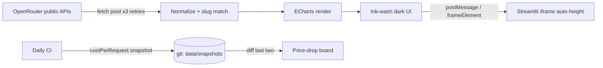

<p align="center">
  
</p>

<h1 align="center">AI Model Rankings</h1>

<p align="center"><b>Real-time AI model power rankings on an ink-wash dashboard (水墨风大模型实时战力榜) — usage, benchmarks, price-performance, speed & trends at a glance.</b></p>

<p align="center">
  
  
  
  
</p>

<p align="center"><b><a href="https://ai-model-rankings.streamlit.app/">🌐 Live Demo (ai-model-rankings.streamlit.app)</a></b></p>

<p align="center"><b>English</b> | <a href="./README.zh-CN.md">简体中文</a> | <a href="./README.ja-JP.md">日本語</a></p>

<p align="center"><i>榜如水墨，浓淡随时 — rankings refreshed like ink, every 5 minutes.</i></p>

📖 Table of Contents
---

- [✨ Features](#-features)
- [🧠 How It Works](#-how-it-works)
- [📖 Usage Guide](#-usage-guide)
- [📁 Project Structure](#-project-structure)
- [🚀 Quick Start](#-quick-start)
- [🌐 Deployment](#-deployment)
- [🛠️ Customization](#️-customization)
- [❓ FAQ](#-faq)
- [📄 License](#-license)

✨ Features
---

- **🏆 Usage Top 12** — real token consumption & request counts of the last 24h across 400+ live models, free variants highlighted.
- **👑 Category Kings** — the current No.1 per discipline: intelligence / coding / agentic (Artificial Analysis), web-dev, dataviz, gamedev, UI (Design Arena ELO), value-for-money and weekly riser.
- **📐 Dimension Champions** — a one-glance table listing the single strongest model per dimension.
- **💰 Price–Performance scatter** — cost per request vs intelligence index, bubble size = usage.
- **⚡ Speed scatter** — P50 latency vs throughput, bubble = request volume.
- **📈 30-day trend** — daily token lines of the top 6 models.
- **🏢 Vendor share & task spend** — weekly market share donut, 30-day spend-by-category donut.
- **🗂️ Category boards** — programming / natural language / long-context / image / tool-call / video boards.
- **🐎 Dark horses & fresh models** — biggest weekly gainers with sparklines; models onboarded in the last 14 days.
- **🧰 Toolbox** — head-to-head model compare (`?vs=slugA,slugB`), free-variants board, China-vs-global duel, **daily price-drop board** (git-as-database snapshots), monthly cost calculator.
- **🔍 Model card** — click any model on any board for a full-dimension popup; jump straight into compare.
- **🖨 Ink stamping** — one-click canvas share cards (Top-5 board or single model) in the site's ink-wash style.
- **🎨 Ink-wash dark UI** — Ma Shan Zheng calligraphy, seal stamps, layered mountains; every vendor rendered in its **real brand color** (Claude orange, GLM blue, OpenAI green…).
- **🔄 Auto-refresh** every 5 minutes, Beijing-time timestamps.

🧠 How It Works
---



1. The browser fetches 12 public OpenRouter endpoints concurrently (3-way pool, empty-payload & network retries).
2. Responses are normalized (unwrapping `{data:{data:[…]}}` variants); dated model slugs are reduced to base slugs to join benchmarks, costs and names.
3. ECharts renders 7 charts + 2 card grids + 1 table; per-vendor brand colors are applied consistently across all charts.
4. A daily CI job commits a `costPerRequest` snapshot into `data/snapshots/` — the price-drop board diffs the last two, giving a static site a history without a backend.
5. `app.py` embeds the page as a full-width Streamlit component; the page stretches its own iframe to the true content height.

📖 Usage Guide
---

- **Tokens / Requests** — toggle the usage leaderboard metric.
- **Category tabs** — switch the category board (编程 / 自然语言 / 长上下文 / 图像 / 工具调用 / 视频).
- **Toolbox (拾贰, collapsed by default)** — head-to-head compare with shareable `?vs=` URLs, free-models board, China-vs-global duel, price drops, cost calculator.
- **Click any model** — full-dimension popup; "加入对比" sends it to the compare tool; "拓印" renders an ink-wash PNG.
- **Hover anything** — every chart carries full tooltips (slug, vendor, share, cost, provider).
- **⟳ 刷新** — force a fresh fetch; data also auto-refreshes every 5 minutes.

📁 Project Structure
---

```
ai-model-rankings/
├── app.py                  # Streamlit entry: embeds the page full-width
├── build.py                # index.html → Streamlit inline rewrite (tested in CI)
├── requirements.txt        # streamlit only
├── .streamlit/config.toml  # dark silk theme for Streamlit chrome
├── index.html              # the page itself
├── css/style.css           # ink-wash dark theme
├── js/app.js               # data layer + charts + cards (exposes window.MB)
├── js/tools.js             # toolbox: compare / free / duel / price-drop / calculator
├── js/card.js              # model popup + ink stamp share cards
├── scripts/snapshot.py     # daily costPerRequest snapshot (CI schedule)
├── data/snapshots/         # git-as-database: daily cost history for the price board
├── vendor/echarts.min.js   # vendored ECharts 5.6.0 (no CDN needed, fully offline)
├── logo.svg                # README header logo
├── avatar.png              # 640×640 repo avatar (upload manually in Settings)
├── docs/index.html         # GitHub Pages redirect page
└── docs/perf-baseline.md   # Lighthouse baseline & decisions
```

🚀 Quick Start
---

Static version (no dependencies):

```bash
python -m http.server 8124
# open http://127.0.0.1:8124
```

Streamlit version:

```bash
pip install -r requirements.txt
streamlit run app.py
```

🌐 Deployment
---

**Streamlit Community Cloud** — fork this repo, then [share.streamlit.io](https://share.streamlit.io) → New app → repo `Mocas-12/ai-model-rankings`, branch `main`, main file **`app.py`** → Deploy. Done.

**Any static host** — Cloudflare Pages / Vercel / GitHub Pages: upload the folder as-is (everything runs client-side).

🛠️ Customization
---

- `REFRESH_SEC` in `js/app.js` — auto-refresh interval (default 300 s).
- `PAL` — the traditional Chinese pigment palette (花青 / 藤黄 / 石绿 / 紫棠 / 赭石 …).
- `BRAND` — official vendor brand colors (Claude orange, GLM blue, OpenAI green…); add an entry to override.
- `CATS` — category boards shown in the tabbed section.
- `CN_AUTHORS` in `js/tools.js` — vendor slugs counted as domestic in the China-vs-global duel.

❓ FAQ
---

<details>
<summary>Why do some charts occasionally show stale data?</summary>
OpenRouter edge nodes sometimes answer <code>200</code> with an empty body. The app retries 3× and falls back to the last good snapshot cached in <code>sessionStorage</code>.
</details>
<details>
<summary>Why is my favorite model missing from a board?</summary>
Boards show the current top entries (usage top 12, category top 8). A model with near-zero traffic today simply has no bar yet.
</details>
<details>
<summary>Does it need an API key?</summary>
No. All OpenRouter endpoints used here are public and CORS-enabled.
</details>

📄 License
---

Released under the [MIT License](./LICENSE). Rankings reflect real OpenRouter traffic and third-party benchmarks (Artificial Analysis, Design Arena); model names and trademarks belong to their owners. For model selection reference only.

---

**Made with 💙** — [🌐 Live Demo](https://ai-model-rankings.streamlit.app/) · [Issues](https://github.com/Mocas-12/ai-model-rankings/issues)
