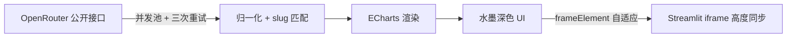

<p align="center">
  
</p>

<h1 align="center">AI Model Rankings</h1>

<p align="center"><b>水墨风 AI 大模型实时战力榜 — 用量、基准、性价比、速度、趋势，一眼看清当下谁最强。</b></p>

<p align="center">
  
  
  
  
</p>

<p align="center"><b><a href="https://ai-model-rankings.streamlit.app/">🌐 在线体验 (ai-model-rankings.streamlit.app)</a></b></p>

<p align="center"><a href="./README.md">English</a> | <b>简体中文</b></p>

<p align="center"><i>榜如水墨，浓淡随时 — 每 5 分钟自动刷新。</i></p>

📖 目录
---

- [✨ 功能特性](#-功能特性)
- [🧠 实现原理](#-实现原理)
- [📖 使用指南](#-使用指南)
- [📁 项目结构](#-项目结构)
- [🚀 快速开始](#-快速开始)
- [🌐 部署](#-部署)
- [🛠️ 自定义](#️-自定义)
- [❓ 常见问题](#-常见问题)
- [📄 许可与免责](#-许可与免责)

✨ 功能特性
---

- **🏆 用量总榜** — 24 小时 400+ 在线模型的真实 Token 消耗与请求次数，免费变体高亮。
- **👑 分项王者** — 综合智能 / 编程 / 智能体（Artificial Analysis）、网页开发 / 数据可视化 / 游戏开发 / UI 组件（Design Arena ELO）、性价比、周涨幅各维度 No.1。
- **📐 维度之最** — 每个维度只列最强的那一个模型，一眼定位。
- **💰 性价比图** — 单请求成本 vs 智能指数散点，气泡大小 = 用量。
- **⚡ 速度榜** — P50 延迟 vs 吞吐散点，气泡 = 请求量。
- **📈 30 天趋势** — Top 6 模型每日 Token 曲线。
- **🏢 厂商份额 & 钱花在哪** — 周厂商份额环形图、30 天任务花费占比。
- **🗂️ 分类用量榜** — 编程 / 自然语言 / 长上下文 / 图像 / 工具调用 / 视频生成。
- **🐎 本周黑马 & 新上架** — 周涨幅黑马（带走势线）、近 14 天新模型。
- **🎨 水墨深色 UI** — 毛笔字标题、朱砂印章、层叠远山；图表厂商色对齐**官方品牌色**（Claude 橘、GLM 蓝、OpenAI 绿…）。
- **🔄 自动刷新** — 每 5 分钟，北京时间标注。

🧠 实现原理
---



1. 浏览器并发抓取 12 个 OpenRouter 公开接口（3 路并发池，空数据与网络错误自动重试）。
2. 响应归一化（兼容 `{data:{data:[…]}}` 等包装）；带日期的模型 slug 归一为 base slug，用于对齐基准分、成本与名称。
3. ECharts 渲染 7 张图表 + 2 组卡片 + 1 张表格；同一厂商在所有图表中保持官方品牌色。
4. `app.py` 将页面作为全宽 Streamlit 组件内嵌；页面自行把 iframe 撑到真实内容高度。

📖 使用指南
---

- **Tokens / 请求次数** — 切换用量总榜指标。
- **分类 tabs** — 切换分类榜（编程 / 自然语言 / 长上下文 / 图像 / 工具调用 / 视频生成）。
- **悬停任意图形** — 均有完整 tooltip（slug、厂商、占比、成本、最快线路）。
- **⟳ 刷新** — 强制重新拉取；数据本身每 5 分钟自动刷新。

📁 项目结构
---

```
ai-model-rankings/
├── app.py                  # Streamlit 入口：全宽内嵌页面
├── build.py                # index.html → Streamlit 内联改写（CI 有测试）
├── requirements.txt        # 仅 streamlit
├── .streamlit/config.toml  # Streamlit 界面暗色主题
├── index.html              # 页面本体
├── css/style.css           # 水墨深色主题
├── js/app.js               # 数据层 + 图表 + 卡片
├── vendor/echarts.min.js   # 内置 ECharts 5.6.0（不走 CDN，离线可跑）
├── logo.svg                # README 头部 logo
├── avatar.png              # 640×640 仓库头像（Settings 手动上传）
├── docs/index.html         # GitHub Pages 跳转页
└── docs/perf-baseline.md   # Lighthouse 基线与决策记录
```

🚀 快速开始
---

静态版（零依赖）：

```bash
python -m http.server 8124
# 打开 http://127.0.0.1:8124
```

Streamlit 版：

```bash
pip install -r requirements.txt
streamlit run app.py
```

🌐 部署
---

**Streamlit Community Cloud** — fork 本仓库后，[share.streamlit.io](https://share.streamlit.io) → New app → 仓库 `Mocas-12/ai-model-rankings`、分支 `main`、主文件 **`app.py`** → Deploy。

**其他静态托管** — Cloudflare Pages / Vercel / GitHub Pages：整目录上传即可，全部逻辑在浏览器端运行。

🛠️ 自定义
---

- `js/app.js` 中 `REFRESH_SEC` — 自动刷新间隔（默认 300 秒）。
- `PAL` — 国画颜料色板（花青 / 藤黄 / 石绿 / 紫棠 / 赭石…）。
- `BRAND` — 厂商官方品牌色（Claude 橘、GLM 蓝、OpenAI 绿…），可增删覆盖。
- `CATS` — 分类榜展示的分类。

❓ 常见问题
---

<details>
<summary>为什么图表偶尔显示旧数据？</summary>
OpenRouter 边缘节点偶发返回 <code>200</code> 空响应体。应用会重试 3 次，失败时回退到 <code>sessionStorage</code> 里上一次的完整快照。
</details>
<details>
<summary>为什么某个模型不在榜上？</summary>
各榜只展示当前头部（用量 Top 12、分类 Top 8），今天几乎零调用的模型暂时没有条形。
</details>
<details>
<summary>需要 API Key 吗？</summary>
不需要。所用 OpenRouter 接口全部公开且支持跨域。
</details>

📄 许可与免责
---

本项目以 [MIT License](./LICENSE) 开源。排名反映 OpenRouter 平台真实用量与第三方评测（Artificial Analysis、Design Arena）；模型名称与商标归各自所有者所有。仅供选型参考。

---

**Made with 💙** — [🌐 在线体验](https://ai-model-rankings.streamlit.app/) · [Issues](https://github.com/Mocas-12/ai-model-rankings/issues)
